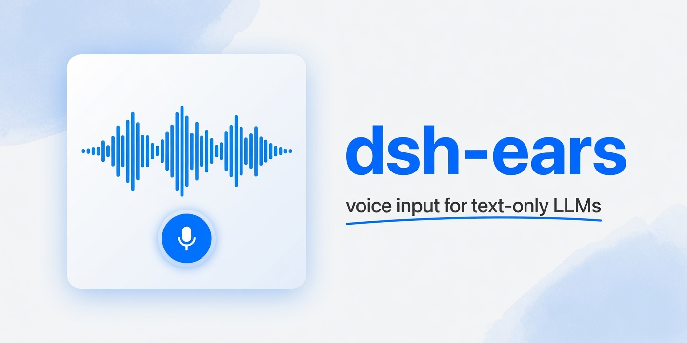

<p align="center">
  
</p>

<h1 align="center">dsh-ears</h1>

<p align="center"><b>Give the text-only DeepSeek a pair of ears.</b></p>

<p align="center">
  An open-source voice-input plugin for <a href="https://github.com/deepseek-ai/deepseek-harness">DeepSeek Harness</a>
</p>

<p align="center">
  <a href="./README.md">简体中文</a> ·
  English
</p>

<p align="center">
  <a href="https://github.com/deepseek-ai/deepseek-harness"></a>
  
  <a href="./LICENSE"></a>
</p>

```text
microphone → transcription → optional polish → editable draft → manual send
```

https://github.com/user-attachments/assets/1363768e-a393-44bd-a008-1ce2055cac41

---

During recording, a recognition bar floats above the composer — waveform animation, stop button, the works. If transcription or polishing is still in progress, the trash icon discards the whole take.

Recognition backends include browser-native Web Speech (words appear in real time), local Whisper, [Groq](https://console.groq.com), [Alibaba Cloud Model Studio](https://www.alibabacloud.com/help/en/model-studio/what-is-model-studio), and any OpenAI-compatible transcription endpoint. Polishing runs through whichever model is already wired up in dsh, with a fully customizable prompt. Default shortcut: `Ctrl+Shift+Space`.

## Install

Prerequisites: [DeepSeek Harness](https://github.com/deepseek-ai/deepseek-harness) (`0.1.0-rc.6` or `rc.7`), Node.js `^22.19.0 || >=24.0.0`.

**From npm:**

```sh
dsh plugin --profile web add dsh-ears
```

Without the `dsh` CLI installed:

```sh
npx -y @deepseek-ai/dsh plugin --profile web add dsh-ears
```

**From source:**

```sh
git clone https://github.com/WizisCool/dsh-ears.git
cd dsh-ears
pnpm install
pnpm build
dsh plugin --profile web add "$PWD"
```

After installation, refresh the Web UI. A microphone icon appears to the right of the composer.

## Usage

1. Click the microphone icon, or press `Ctrl+Shift+Space`.
2. Start speaking.
3. Press the shortcut again (or click again) to stop recording and begin transcription.
4. With polishing enabled, the raw transcript lands in the draft first and gets replaced once polishing finishes — any manual edits made in between are preserved.
5. Review and send.

When the selected backend is not ready, the microphone icon grays out. Hovering it shows the reason.

## Recognition backends

| Backend | How it works | Requirements | Free allowance |
| --- | --- | --- | --- |
| Web Speech | Live in-browser recognition, words appear in real time | A Chromium-based browser. Audio may be routed through the browser vendor | — |
| Local Whisper | Host runs the `whisper` CLI after recording stops | openai-whisper installed locally; download a model from the plugin settings page (weights are not bundled) | — |
| [Groq](https://console.groq.com) | Host sends the recording to the Groq Whisper API | A Groq API key | Always Free, [Rate Limited](https://console.groq.com/docs/rate-limits) |
| [Alibaba Cloud Model Studio](https://www.alibabacloud.com/help/en/model-studio/what-is-model-studio) | DashScope sync transcription (Flash family) | HTTPS origin, API key, and model name. Recordings cap at 300 s | [New-user free quota](https://www.alibabacloud.com/help/en/model-studio/new-free-quota) |
| Custom OpenAI-compatible | POST to a given `/audio/transcriptions` endpoint | Endpoint URL, API key, and model name | — |
| 🤝 Add a new backend | — | [Open a PR](https://github.com/WizisCool/dsh-ears/pulls) to contribute another transcription service | — |

> Allowances above are copied from provider docs. This README may lag. Use the provider's latest documentation.

> Whisper `medium` and larger models rarely finish within 120 s on CPU alone. A GPU or a faster local runtime is recommended.

## Polishing

The polish model is picked from models already configured in `dsh → Settings → Models`. The plugin only persists the provider, model name, and prompt; the LLM key comes from dsh's existing configuration.

The default prompt removes fillers, fixes common ASR errors, resolves spoken self-corrections ("not A — actually B"), and formats explicit enumerations. Leaving the prompt blank activates the built-in default, which can be reviewed in the settings page. When polishing fails or is cancelled, the raw transcript is kept as-is.

## Local development

```sh
pnpm install
dsh plugin --profile web add "$PWD"
pnpm check
pnpm test
pnpm build
pnpm dev:config   # build and write the HMR overlay
pnpm dev:web      # start dsh web
```

Run `pnpm dev:watch` in a second terminal during development. `pnpm dev:config` writes `.dsh/cordis.patch.yml` (git-ignored) for HMR and does not register an additional plugin entry.

## Docs

- [CHANGELOG](./CHANGELOG.md)
- [CONTRIBUTING](./CONTRIBUTING.md)
- [SECURITY](./SECURITY.md)
- [LICENSE](./LICENSE)

Contributor guide and architecture notes: [CONTRIBUTING.md](./CONTRIBUTING.md), [AGENTS.md](./AGENTS.md), [`.agent/`](./.agent/README.md).

## License

[MIT](./LICENSE)
